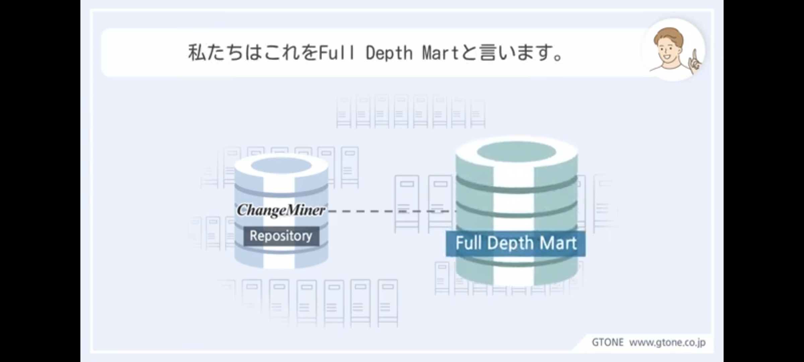
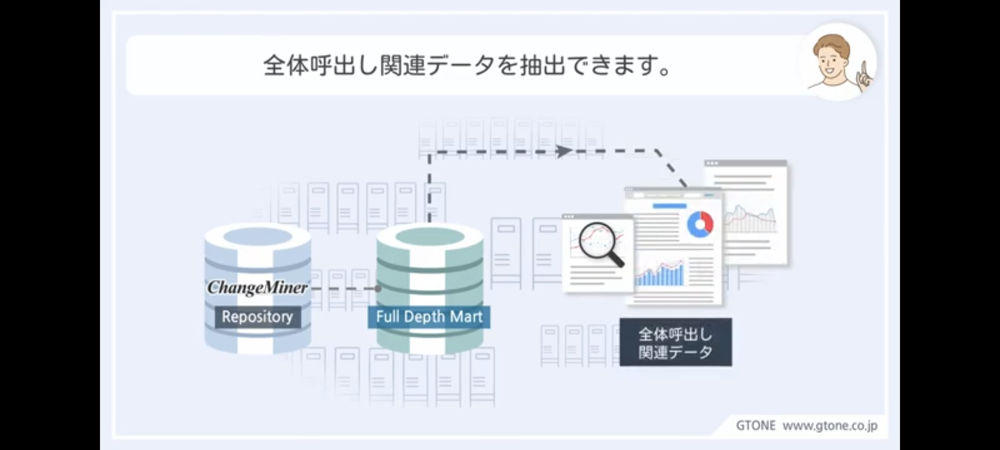
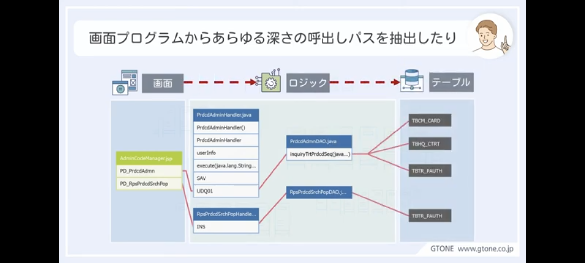
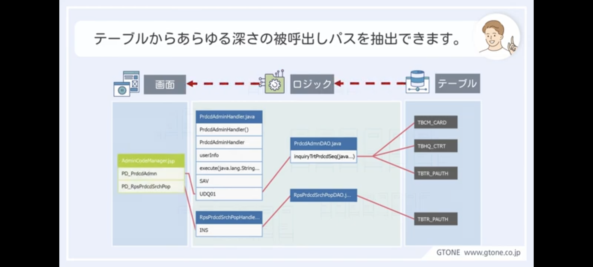

# ChangeMiner

タグ: ChangeMiner
作成日時: 2024年2月13日 19:48
最終更新日時: 2024年2月13日 20:33

# とは

一言：アプリケーション自動分析ツール

言語、フレームワーク、データベースなど様々なシステム情報を収集し、プログラムやデータベース間の関連を可視化します。 特に、システム改修やプログラム受入検証時の障害予防や影響分析等に利用する事で、開発・保守の生産性を飛躍的に向上させる事が可能となります。

# できること

様々なデータ形式を読み込んで、加工可能。

様々な形でデータを見える化。

ダッシュボード管理。

Eclipseプラグイン。

# 使用の流れ

次世代高度化プロジェクトを進めるには、

既存ITシステムについて正確な現状把握が必要。

既存システムの現状把握を行う必要があるが、成果物の陳腐化で役に立たないことがある。

直接ソースコードやDBを分析するが時間と費用がかかることや、ヒューマンエラーも考えられるため既存システムをある程度自動分析できるツールが必要。

そこで、ChangeMinerを活用する。

changeMinerを活用するのに必要な情報は、

画面プログラムからDBプログラムまでのすべての呼び出し関連情報。

これらをchangeminerを利用して、既存システムを分析。

分析結果である関連情報の基礎データは、changeminerリポジトリへ保存される。

基礎データに基づいてAS-IS分析に必要なデータマートを作る。これをFullDepthMartという。

FullDepthMartで画面プログラムからテーブルまでの全体呼び出し関連データを抽出できる。

例えば、画面プログラムからあらゆる深さの階層の呼び出しパスを抽出したり、

テーブルからあらゆる深さの階層の被呼び出しバスを抽出できる。

これにより、FullDepthMartの呼び出し関連情報を利用して、既存システムの内部構造を素早く把握し新しい高度化プロジェクトのための分析設計の時間とコストを削減できる。

---

# Appendix

[公式サイト](https://www.ashisuto.co.jp/product/category/application-governance/changeminer/)