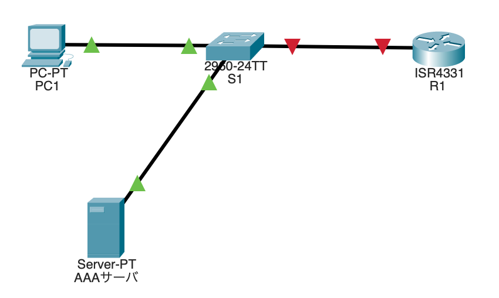
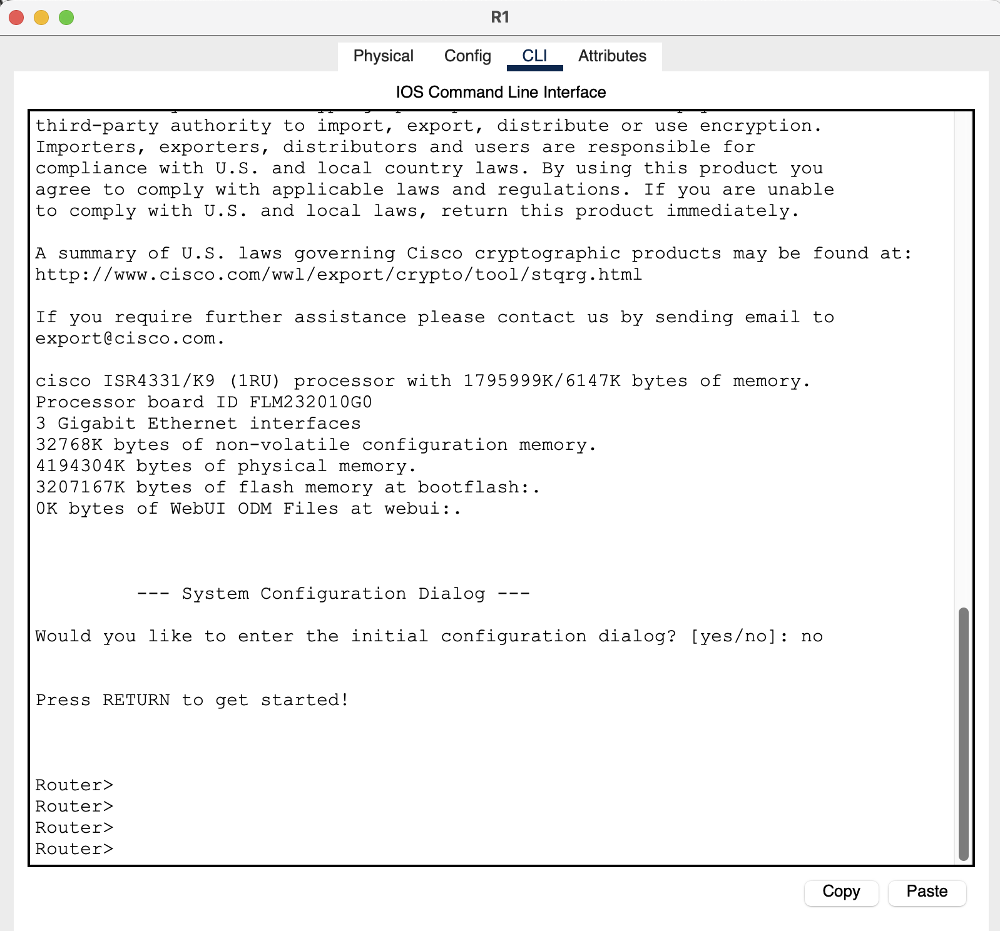
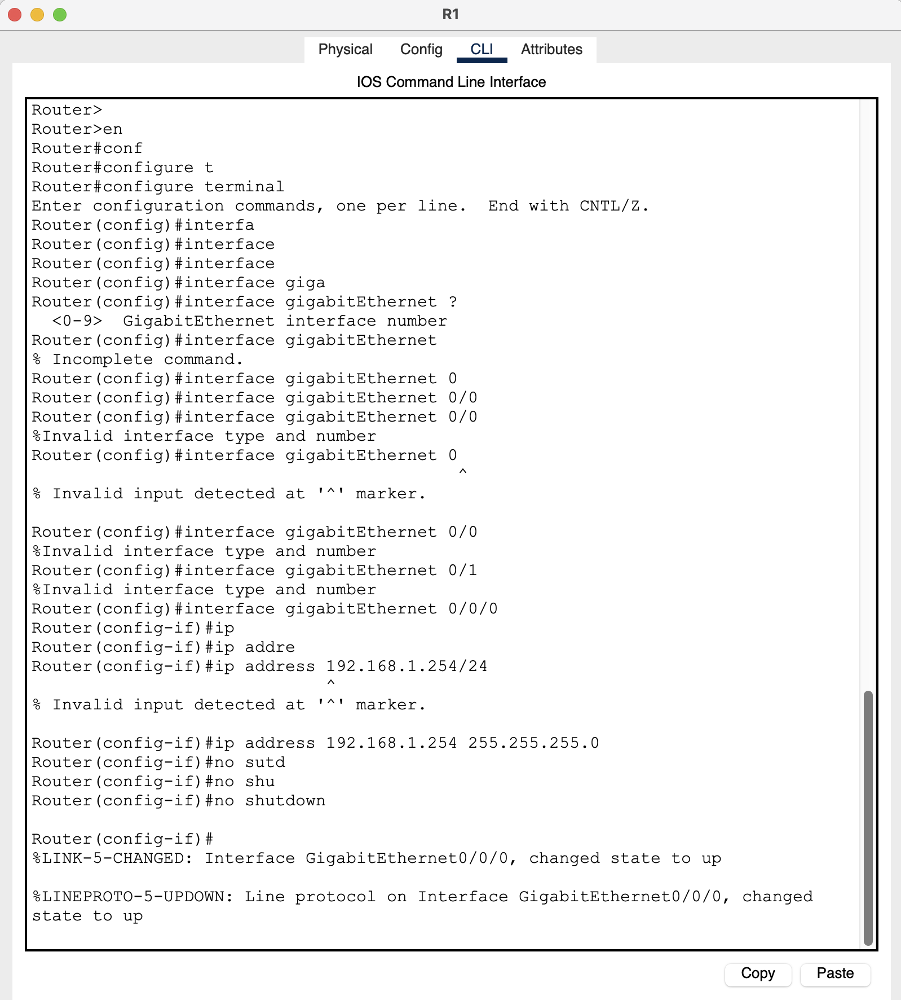
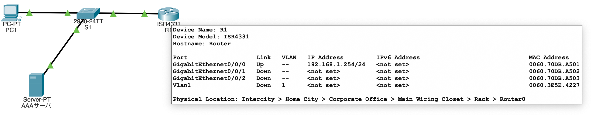
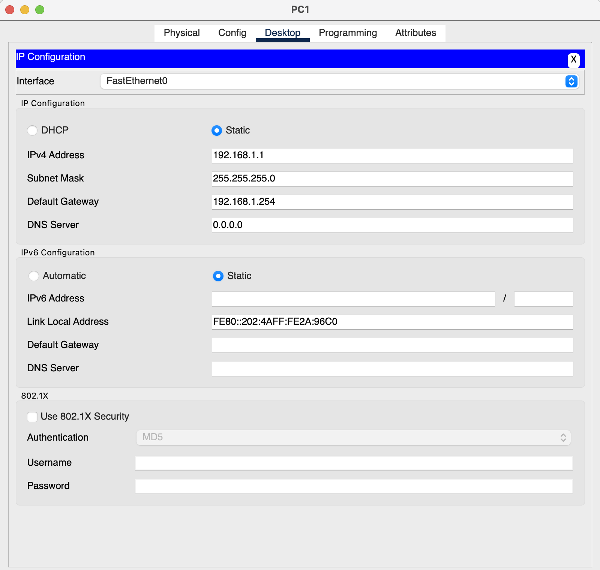
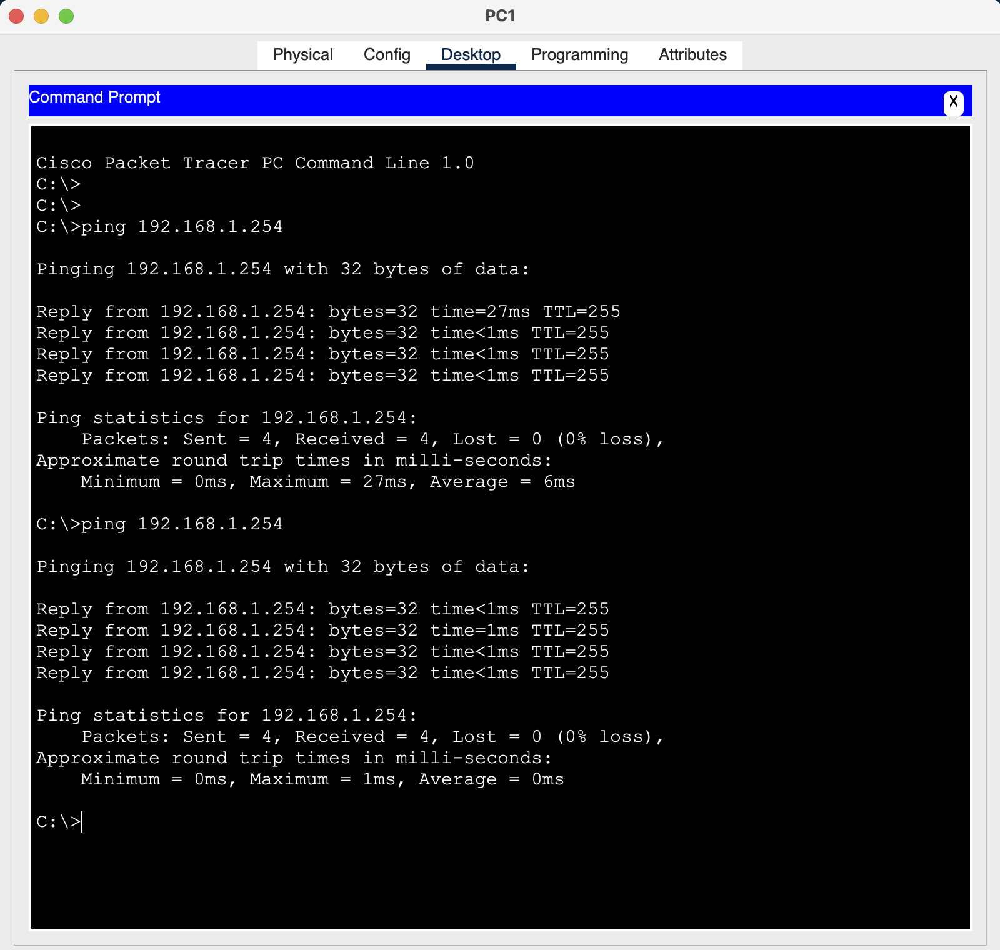
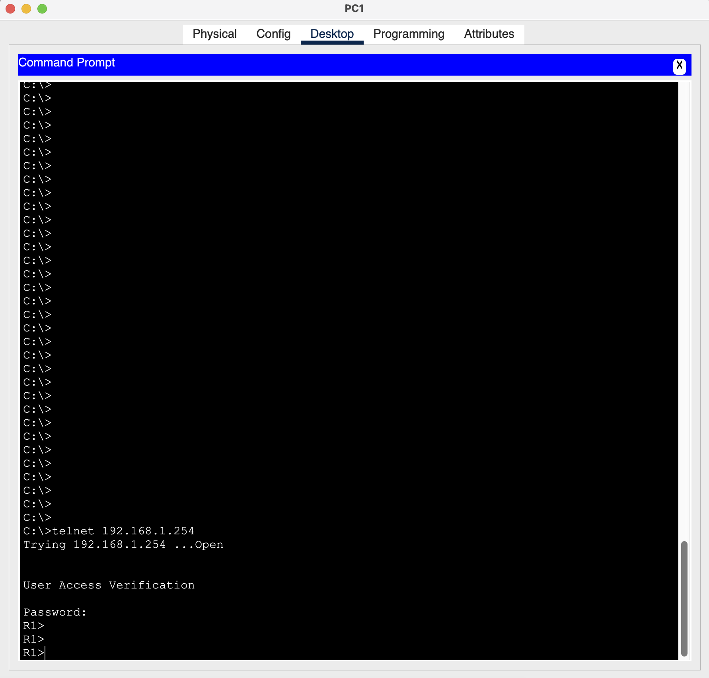
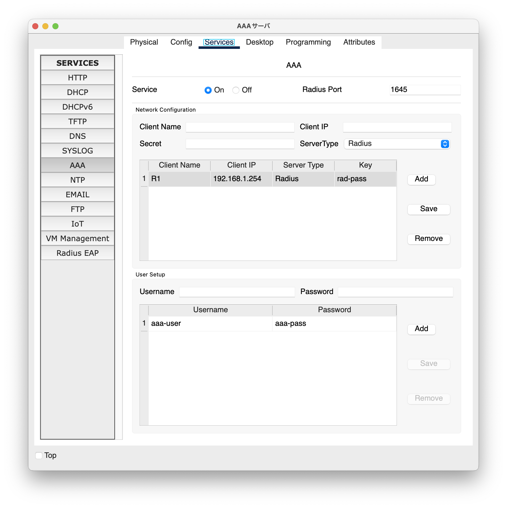
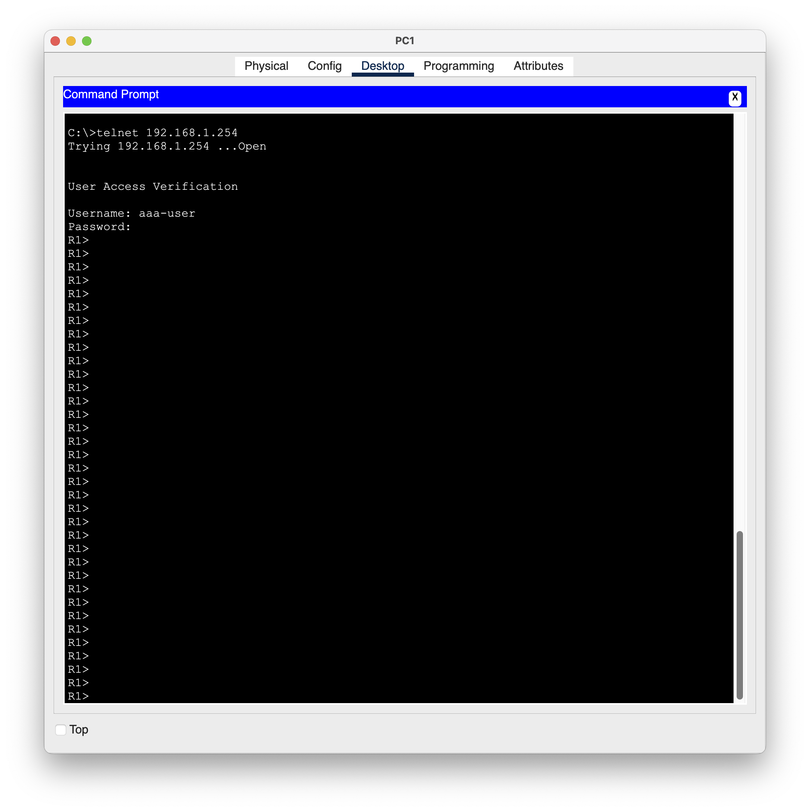

# CiscoPacketTracerとは
Cisco公式で開発リリースされた、cisco製品ルータなどのモデレータを利用して、詳細に検証を行えるツールのこと。

# Cisco Packet Tracerの使い方
- CLI操作時に文字が小さすぎるのでcmmand + RでFontで文字の大きさを調整しておく
- 各種機材やケーブルなどは基本的にアイコンをクリックして配置したい場所を再度クリックすればOK。もしくはドラックアンドドロップ

## 確認コマンド
- `show running-config`: 全体の設定を表示します。
- `show ip protocol`: IPプロトコルに関する設定を表示し、Telnetサービスが有効になっているか確認できます。
- `show line vty`: VTY（仮想端末）の設定を表示し、Telnetアクセスが許可されているか確認できます。

# AAAサーバ（RADIUS認証）の演習

## PCとルータ（AAAサーバを除く）設定及び疎通確認作業

### 機材の配置と接続

緑色の矢印は、Fowerding状態を表している。

Fowerding状態とは、
受け取ったデータパケット情報（宛先IP）を見て、次の転送先を決定し、転送することをいう。

ルーターとスイッチ間で赤色になっている箇所は、Ciscoルータのインターフェースはデフォルトでシャットダウンしているいることが起因しておりシャットダウンと解除(no shutdown)させる必要がある。

### CiscoルータIP設定
- Ciscoルータ設定
    - インターフェースのシャットダウン解除
        - Ciscoルータをクリック
        - CLIタブクリックするとCisco機器にコンソール接続したCLI画面が表示される
        - noを選択

        
    - GigabitEthernet 0/0へIPアドレスの割り当て
        - enでenableモードに入る（#）
        - conf tでconfigモードに入る（(config)#）
        - interface gigabitethernet 0/0/0（int g0/0/0でもいけるポイ）でconfig-ifの設定をする
        - ip addressで192.168.1.254/24で設定する（プレフィックス指定で設定はできないため255.255.255.0で指定して設定すること）
        IPアドレス「192.168.1.254/24」の範囲は、**192.168.1.1～192.168.1.254**
        - no shutdownでケーブルリンクをアップさせる

        
        - 設定完了後、ルータ⇄スイッチ間でケーブルリンクは緑色になっていることを確認する

### PC-IP設定

- PC設定
    - IPアドレス設定
        - PCクリック
        - タブのDesktop、IP Configrationをクリック
        - Ipv4 Adressに192.168.1.1を入力
        - subnetmaskは自動的に255.255.255.0が入る
        - defaultgatewayは、192.168.1.254を入力
        - 特に保存などはないため、設定完了後は閉じる

        

### ルータ名変更と特権EXEモードのPW設定

ルータ接続後のenモードにスイッチする際にPWを求める

- Ciscoルータクリック
- CLI画面を表示
- enでenableモードに入る（Router#になる）
- conf tでconfiguration terminalモードに入る（Router(config)#になる）
- hostname R1でホスト名を変更する（Router(config)#からR1(config)#に変わる）
- enable sercret ciscoで特権EXEモードへのPWを設定する
→enのenableモードになるときにPWを求められるようになる

### VTY（Virtual TTY）のPW設定

Virtual TTYは日本語で「仮想端末」でネットワーク機器（ルーターやスイッチ）にリモートから接続を行い、設定変更や監視を行うための仮想的な端末を表す。

VTYを使用した接続例として、telnetやssh接続がある。

VTY設定をしない場合はコンソールケーブルで直接ルータとPCを接続させる必要があることとルータに対して1人しか接続ができないことになる。

- Ciscoルータクリック
- CLI画面を表示
- enでenableモードに入る（Router#になる）
    - ここでPWを求められた場合は、上記手順「特権EXEkモードのpW設定」で設定したPW(cisco)を入力する
- conf tでconfiguration terminalモードに入る（Router(config)#になる）
- line vty 0 4を実行（R1(config-line)になる）
- line vty 0 4に対してpassword vtypass0_4を設定
- loginを実行
    - login : 特定のインターフェイスやVTY接続に対して認証を要求するようにする設定コマンド。これの設定がないとVTY接続（telnet, ssh）する際にPW認証なしでログインができてしまう。
- endを実行
    - end : 現在いるコンフィギュレーションモードからユーザEXEモードもしくは特権EXEモードに戻るコマンド
- copy run startup-configを実行
ルータの起動設定ファイルを保存するというコマンド
Destination filename [startup-config]?と問われるためそのままEnter
Building configuration...
[OK]
    - running-config：ルーターの現在動いている設定ファイル。
    揮発性メモリ（DRAM）に保存されているためルーターを再起動すると消えてしまう。
    - startup-config：ルーターを起動する際に読み込まれる設定ファイル。
    不揮発性メモリ（NVRAM）に保存されるためルーターを再起動していも保持される。

### 通信の確認

- PC（192.168.1.1）からルータ（192.168.1.254）にpingを打ってみる
    - PCをクリック
    - Desktopタブのcommand promptを起動
    - ping 192.168.1.254を打ってみる

    

PCとルータ間で正常に通信ができました

- PC（192.168.1.1）からルータ（192.168.1.254）にtelnet接続をしてみる
    - PCをクリック
    - Desktopタブのcommand promptを起動
    - telnet 192.168.1.254を打ってみる
    - VTY-PWを求められたら「vtypass0_4」を入力して接続できたら成功

    
    PCとルータ間で正常に通信ができました
    

## AAAサーバとルータの設定及び疎通確認作業

### AAAサーバのRADIUS認証設定

- AAAサーバをクリック
- Servicesタブをクリック
- AAAをクリック
- ServiceをONにする
- NetWork設定し、addをクリック
    - Client Name : R1
    - Client IP : 192.168.1.254
    - Secret : rad-pass
    - ServerType : Radius
- User設定し、addをクリック
    - Username : aaa-user
    - Password : aaa-pass

### AAA-2サーバのRADIUS認証設定

- AAA-2サーバをクリック
- Servicesタブをクリック
- AAAをクリック
- ServiceをONにする
- NetWork設定し、addをクリック
    - Client Name : R1
    - Client IP : 192.168.1.254
    - Secret : rad2-pass
    - ServerType : Radius
- User設定し、addをクリック
    - Username : aaa2-user
    - Password : aaa2-pass

### R1ルータのRADIUS認証設定

- R1ルータクリック
- CLIタブクリック
- enでenableモードになる
PWは「cisco」
- conf tでconfiguration terminalモードになる
- aaa new-model
- aaa autentication login default group radius local
    - authentication : 認証構成パラメータを設定
    - login : ログイン用認証リストを有効にする
    - default : デフォルトの認証リスト
    - group : サーバグループを使用
    - radius : 全てのRADIUSリストを使用
    - local : 認証にはローカルユーザ名を使用
- radius server host（R1(config-radius-server)#に変わる）
    - ルーターが認証やアカウンティングに使用するために通信をする
    RADIUSサーバのIPアドレスを指定するコマンド
    - address ipv4 192.168.1.10でAAAサーバ（RADIUSサーバ）のIPアドレスを登録する
    - key rad-pass
    rad-passにAAAサーバのRADIUS認証設定で行ったNetwork設定の「Secret : rad-pass」と一致させる必要がある
        - 以下のWARNINGが出るが問題ない
        
        WARNING: Command has been added to the configuration using a type 0 password. However, type 0 passwords will soon be deprecated. Migrate to a supported password type
        *Sep 21 18:55:14.936: %AAAA-4-CLI_DEPRECATED: WARNING: Command has been added to the configuration using a type 0 password. However, type 0 passwords will soon be deprecated. Migrate to a supported password type
        
    - end
    - copy run startup-config（copy running-config startup-config）を実行
    ルータの起動設定ファイルを保存するというコマンド
    Destination filename [startup-config]?と問われるためそのままEnter
    Building configuration...
    [OK]

### 通信の確認

AAAサーバ（RADIUSサーバ）設定前はVTY接続でVTY-PWが問われたが、今度はRADIUS認証になっているはず。

- PC（192.168.1.1）からルータ（192.168.1.254）にtelnetを打ってみる
    - PCをクリック
    - Desktopタブのcommand promptを起動
    - telnet 192.168.1.254を打ってみる
