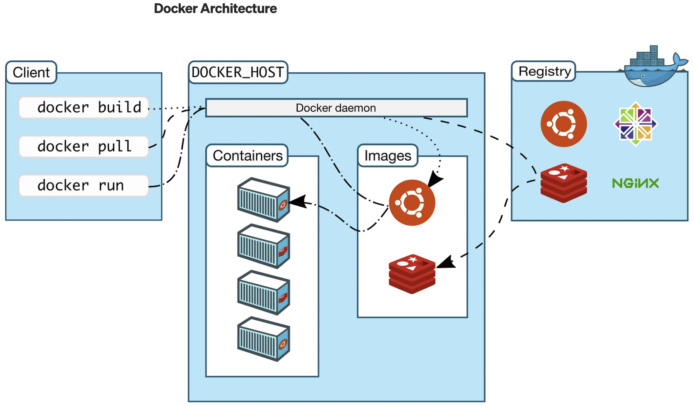

# Dockerとは

## 基本情報

- [Docker公式サイト](https://www.docker.com/ja-jp/)
- リリース年：2013年
- 開発会社：Docker, Inc.
- 主要コンポーネント：Docker Engine, Docker Hub, Docker Compose
- 製品：[Docker Hub](https://www.docker.com/ja-jp/products/docker-hub/), [Docker Desktop](https://www.docker.com/ja-jp/products/docker-desktop/), [Docker Scout](https://www.docker.com/ja-jp/products/docker-scout/), [Docker Build Cloud](https://www.docker.com/ja-jp/products/build-cloud/)
- サポートプラットフォーム：Linux, Windows, macOS
- ライセンス：Apache License 2.0
- 利用分野：アプリケーションデプロイメント、開発環境の構築、マイクロサービスアーキテクチャ、CI/CDパイプライン、DevOpsプロセス
- 主要な技術：コンテナ仮想化、イメージ管理、環境再現性、オーケストレーション
- 料金プラン：[Personal, Pro, Team, Business](https://www.docker.com/ja-jp/pricing/)

## Dockerの基本的な概念

1. **イメージ (Image)**
イメージは、コンテナを作成するためのテンプレートです。必要なアプリケーションやライブラリがすべて含まれています。
2. **コンテナ (Container)**
コンテナは、イメージから作成される実行可能なインスタンスです。コンテナは、必要なコード、ライブラリ、設定ファイルなどを含み、どの環境でも一貫して動作します。
3. **Dockerfile**
Dockerfileは、イメージを作成するための指示が書かれたテキストファイルです。どのベースイメージを使うか、どのソフトウェアをインストールするかなどが記述されています。
4. **レジストリ (Registry)**
レジストリは、Dockerイメージを保存しておくためのリポジトリです。Docker Hubが代表的なパブリックレジストリです。

## Dockerの利点

1. **一貫性**：開発環境と本番環境で同じ環境を簡単に再現できます。
2. **移植性**：異なるシステム間で簡単にアプリケーションを移動できます。
3. **効率性**：必要なリソースのみを使用するため、効率的にリソースを利用できます。

これらの要素により、Dockerはアプリケーション開発やデプロイをより簡単かつ効率的にする強力なツールとなっています。