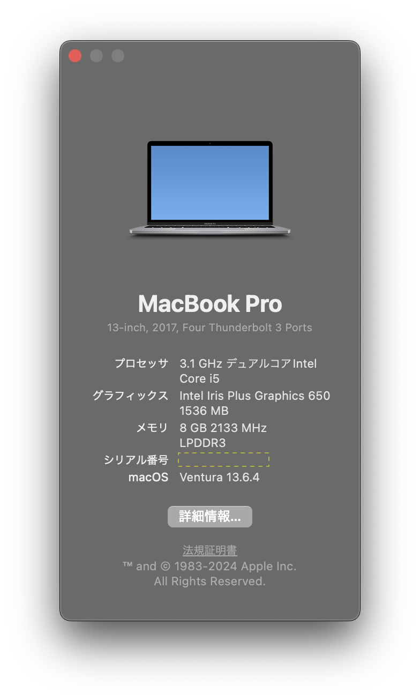
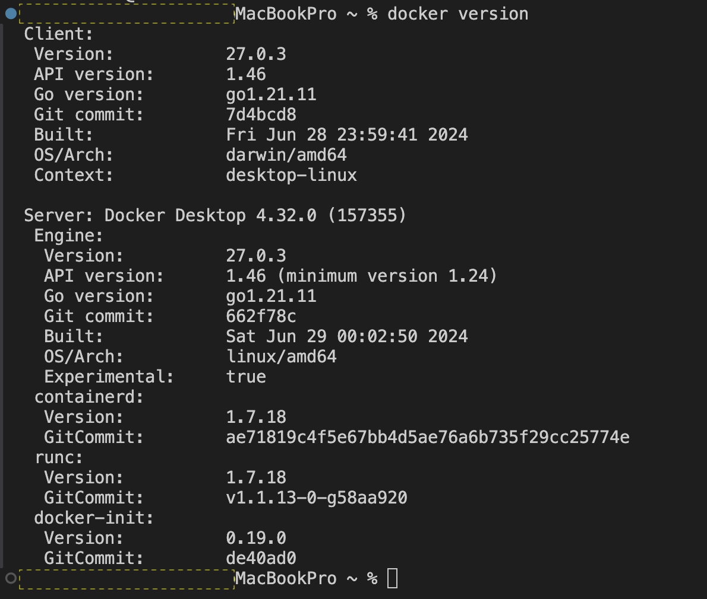
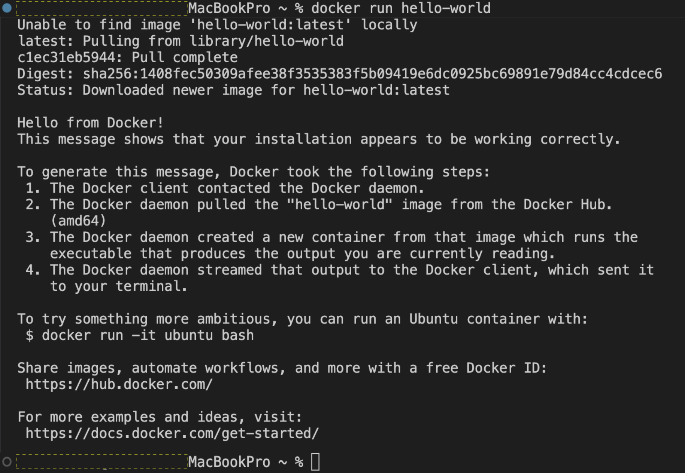
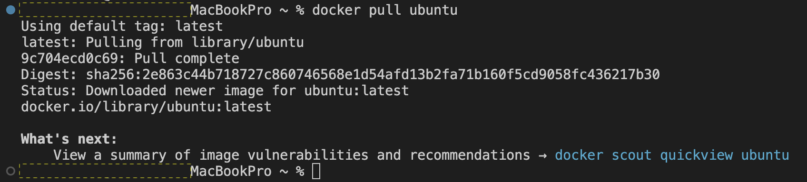
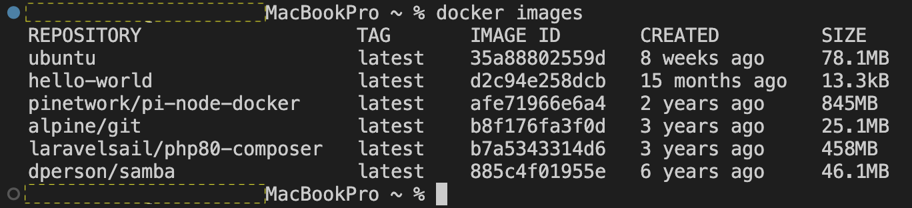
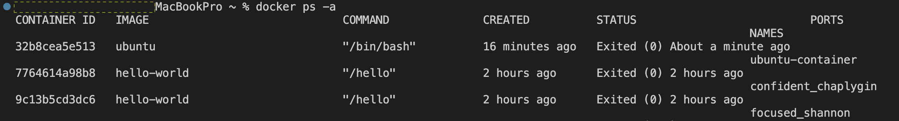
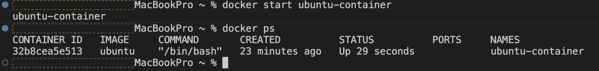

# Docker Desktopを利用してUbuntuの初期セットアップ <!-- omit in toc -->
- [前提](#前提)
- [手順](#手順)
- [Docker Desktopインストール](#docker-desktopインストール)
- [Ubuntuコンテナの構築](#ubuntuコンテナの構築)
  - [ubuntuイメージの取得](#ubuntuイメージの取得)
  - [ubuntuコンテナの作成・起動](#ubuntuコンテナの作成起動)
  - [ubuntuコンテナ内に色々入れていく](#ubuntuコンテナ内に色々入れていく)
    - [最新パッケージ情報を再取得](#最新パッケージ情報を再取得)
    - [vimのインストール](#vimのインストール)
    - [sudoインストール](#sudoインストール)
    - [viewのインストール](#viewのインストール)
    - [ユーザ作成](#ユーザ作成)

# 前提

- 実行環境
macOS：Ventura（13.6.4（22G513））

# 手順

# Docker Desktopインストール

1. [Docker Desktopのインストール（mac用）](https://matsuand.github.io/docs.docker.jp.onthefly/desktop/mac/install/)
2. ターミナルで、`docker version`コマンドでDockerバージョンの確認
    
    
    
3. Hello Worldを実行してみる
    1. `docker run`コマンドはイメージからコンテナを作成するコマンド
    2. ただし、ローカルにhello-worldというイメージファイルがないためdockerデーモンはhello-worldイメージをdocker hubからDLし、コンテナを作成する
    
    
    

# Ubuntuコンテナの構築

## ubuntuイメージの取得

1. ubuntuのdockerイメージの取得
docker hubイメージを指定する場合は、ubuntu:<タグ名>
    
    
    
1. 取得したdockerイメージの確認
CREATEDは、恐らくimageが作成されてからの時間（imageをDLしてからの時間ではない）
    
    
    

## ubuntuコンテナの作成・起動

1. ubuntuコンテナの作成と起動
-i : interactive（相互作用の略）シェルなどでコンテナ内で操作が可能
-t : tty（端末デバイスの略）コンテナの標準出力とホストの出力をつなげる
    
    
    
1. 存在しているコンテナの確認
-a : 停止中のものも含めた全てのコンテナ
STATUS Exited : 停止状態
    
    
    
1. コンテナの起動
    
    
    
2. 起動中コンテナへの接続
    1. `docker attach <コンテナ名 or ID>` コマンドの例
    exitコマンドで抜けるとコンテナが停止する
    起動させたまま抜ける場合は、Ctrl + P, Ctrl + Q
    2. `docker exec -it <コンテナ名 or ID> /bin/bash`コマンドの例
3. 取得したイメージの一覧
`docker images`

## ubuntuコンテナ内に色々入れていく

### 最新パッケージ情報を再取得

`apt update`

以下の作業については、次のコマンドで一括してやってくれるそう
`apt dist-upgrade` 

※今回は、`apt dist-upgrade` は実施せずに以下を順に実施

> 【パッケージ・カーネルの更新】
> 
> - アップグレード可能なパッケージを確認
> `apt list —-upgradable`
>     1. パッケージを最新化
>     `apt upgrade`
>     2. アップグレード可能なパッケージがないことを確認
>     `apt list --upgradable`
> - 不要なパッケージの確認
> `apt purge`
>     1. 不要なパッケージの削除
>     `apt autoremove`
>     2. アーカイブファイルの削除
>     `apt autoclean`
> - カーネルの最新化
>     1. 現在のバージョン確認
>     `uname -r`
>     2. カーネルを最新化
>     `apt install linux-image-generic`
>     更新途中で地理(geographic area)と地域(region)を問われた
>     3. 更新後のカーネルバージョン確認
>     `uname -r`
>     →6.6.32-linuxkit
>     4. OS再起動
>     exitでコンテナから抜けて、`docker restart <コンテナ名 or ID>`を実行

### vimのインストール

1. vimインストール
`apt install vim` 

### sudoインストール

1. sudoインストール
`apt install sudo`

### viewのインストール

1. viewインストール
`apt install view`

### ユーザ作成

1. ユーザを追加する
`adduser <ユーザ名>`
※`useradd`はホームディレクトリが作成されない
    1. sudoグループに追加
    `gpasswd -a <ユーザ名> sudo`
    ※`-a` は-addの略のため必須
    2. ユーザアカウント情報一覧
    `cat /etc/passwd`
    3. ユーザ情報確認
    `id`