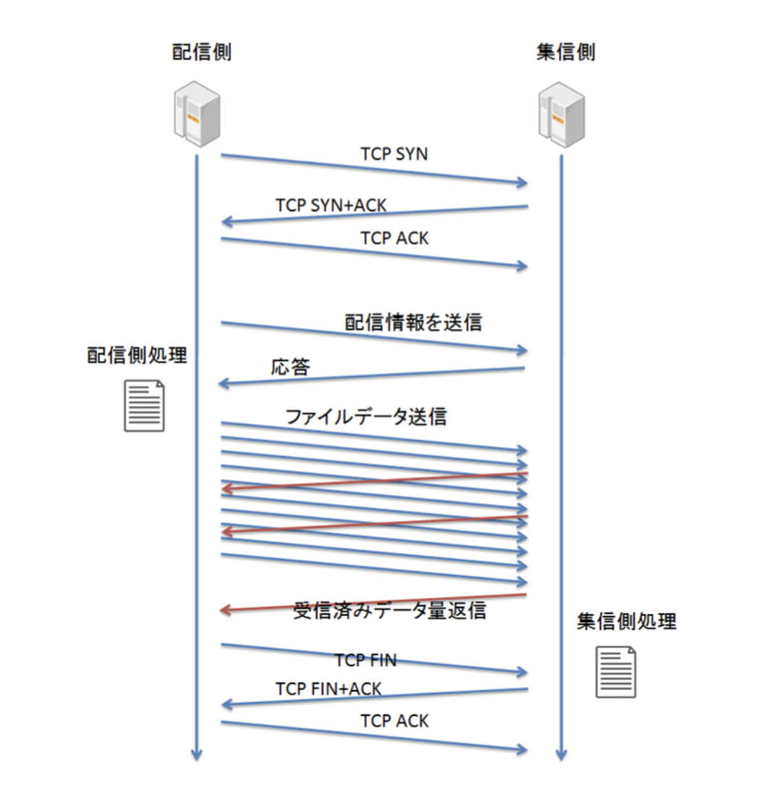
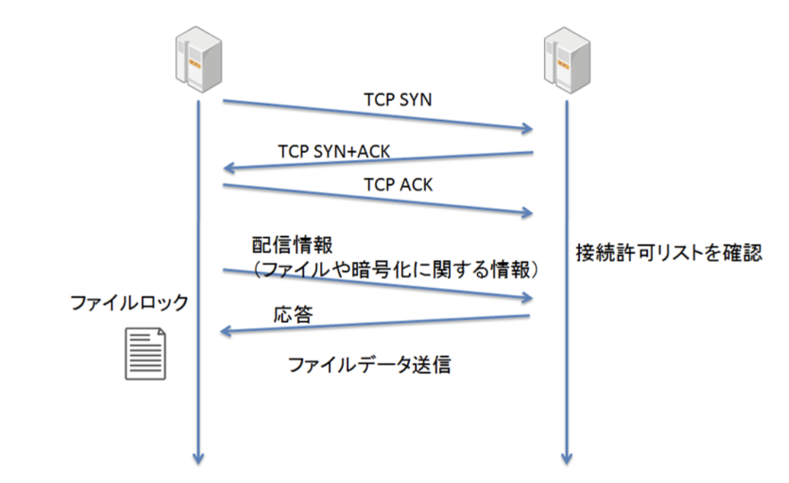

# HULFT

タグ: HULFT, MFT, ファイル連携
作成日時: 2024年2月19日 9:19
最終更新日時: 2024年2月20日 19:58

# HULFTとは

HULFT（ハルフト）は、セゾン情報システムズが開発・販売するファイル転送ソフトです。ネットワークで接続されているプラットフォーム間で、TCP/IPプロトコルを使用して、ファイル転送をはじめとする各種機能を実行するミドルウェアです。

HULFTは、企業内や企業間の業務システムを接続し、日常のシステム運用で発生するデータ連携を自動化することができます。企業の情報システム内に混在するWindows、Linux、UNIXのほか、AWSやAzureなどのクラウド上のシステムで生成されるログデータやCSVファイルなどのあらゆるデータを、ファイル単位で安全、確実に転送します。

# HULFT配信の流れ

HULFTでのファイル転送は、ファイルを送信する配信側ホストから、ファイルを受信する集信側ホストに向けてのTCP接続確立から開始します。

TCP接続確立後、配信側はファイルを圧縮など（コード変換、暗号化）を行って前処理を行った後にTCPを使用して集信側へ送信する。

集信側はファイル受信後、解凍など（復号、コード変換）を行った後にジョブ連携される。

ファイル転送後は、TCP接続が切断される。

# TCP接続と初期設定

TCP SYN, TCP SYN+ACK, TCP ACKと配信側と集信側でやり取りを行い、TCP ACKが送られた際に集信側でTCP接続を要求してきた配信側ホストが接続許可リストに登録されているかをチェックします。（登録がない場合切断となる）

TCP接続確立後、配信側ホストはHULFT転送に必要な情報を集信側ホストへ送信する。配信側ホストが最初に送信する情報には、転送されるファイルに関する情報の他に、暗号化に必要な情報などが含まれます。

配信側はTCP接続直後のやり取り終了後に、転送するファイルに対してロックをかけます。集信側も、受け取るファイルを書き出すためのファイルを生成したうえでロックをかけます。これにより、配信側と集信側の双方で、他のプロセスがファイル転送中にファイルの内容を変更してしまうことによって発生する不具合などを防いでいます。ロックをかける作業は、一見地味であり忘れがちですが、ファイル転送を行うシステムを堅牢に実現するうえでは非常に重要なのです。