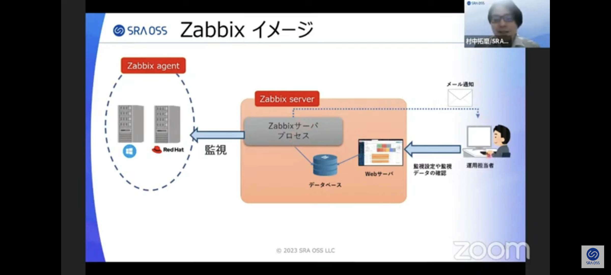
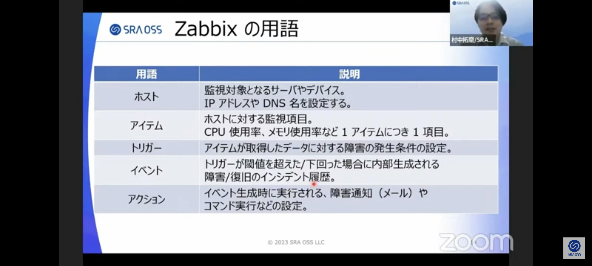

# Zabbix

タグ: zabbix, 監視
作成日時: 2024年2月13日 9:33
最終更新日時: 2024年2月13日 12:25

# 役割

本来稼働しているはずのサービスに障害が発生したとき、事前に監視設定をすることによって障害発生の原因や早期発見を目的としている。問題があれば、通知してくれるOSS。

# 監視できるもの

- サーバーリソース（メモリ、CPU）
- ネットワーク（疎通状態）
- アプリケーション（プロセスが稼働しているか）
- WEBアプリケーション（webページが表示されているか）
- ログ（サーバやアプリケーションにエラーが発生していないか）

# 使用イメージ

# Zabbix用語

# 障害の発生条件（トリガー）

例）メモリ使用率が80%を超えたら障害とする。

# 障害発生時の通知（アクション）

メールやslackなどのアプリケーション通知。

10分おきなどの継続して通知も可能。

# テンプレート

アイテムやトリガーなどをテンプレート化でき、複数のホストに対して同じ監視設定を即座に設定することが可能。

# バージョン

LTSとポイントリリース

LTS（long term support）とは、1年半周期リリース

ポイントリリースとは、半年周期リリース

サポート期間もポイントリリースは約半年となるため通常はLTS推奨。